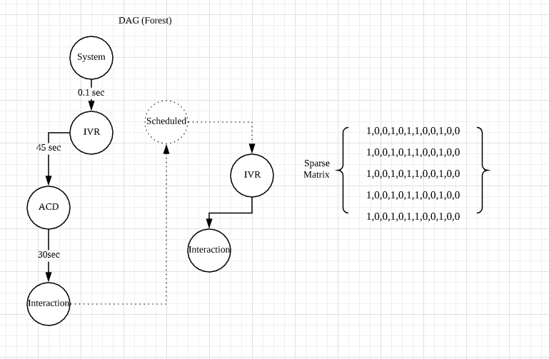

## Skills

Core Strengths

* Algorithm & Data Structure
* Mathematics
* Design Patterns
* Microservices

Programming Languages

* C# (.Net Core 2.x - 3.0)
* Python(3.x, Anaconda, Plotly, Jupyter Notebook) 
* C++14 (FFMPEG) 
* Powershell/Shell scripting
* `yml` CI/CD configuration scripting

Tools

* Teamcity (CI/CD pipeline)
* Visual Studio / Visual Studio Code / Vim
* Docker / Kubernetes / Rancher / Apache Nifi
* Jira Software / Confluence
* Lucidchart

Cloud Services

* Microsoft Azure (Storage Blob, DocumentDB, ServiceBus etc.)
* AWS (EC2, S3 Bucket, DynamoDB etc.)

## [Wordbench](https://wordbench-dev-anz.calljourney.com/dashboard/CallJourney-Development/all)

WordBench converts audio into searchable text and compressed audio, which is then organized and archived for analysis in an intuitive web interface. It processes audio in near real-time and can handle up to one million calls per day. By having access to every single call in your organization, you have the power to drill down into specific categories to find the exact information you want.

## Audio Redaction Process

Automactic redaction of "noice" data during audio processing prvents users of the speech analytics system from getting inaccurate outcomes from transcripts.

### A Standard Telephony Conversation Between Customer & Agent

### A Callback/Secduled Telephony Conversation

### A Directed Acyclic Forest Solution

### FFMPEG Command Line
## -filter_complex ""channelsplit[l][rpre];[rpre] volume=enable='between(t,{StartSeconds},{EndSeconds})':volume=0 [r];[l][r]amerge"" -acodec libopus

