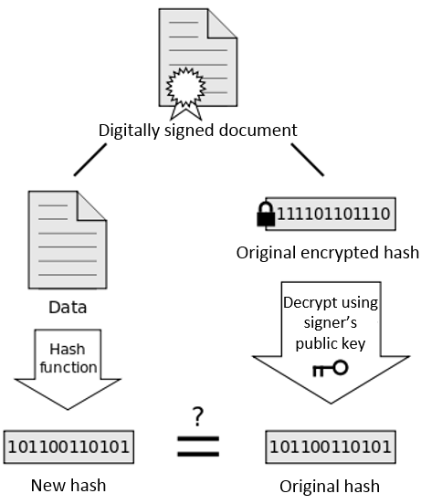
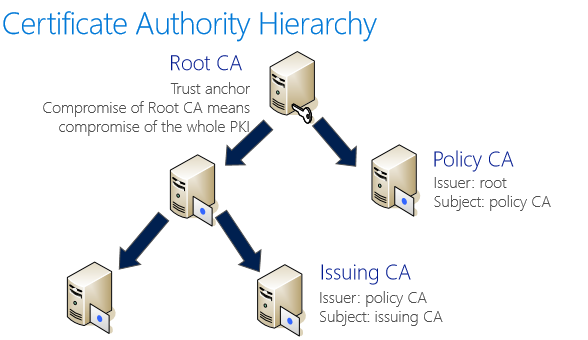
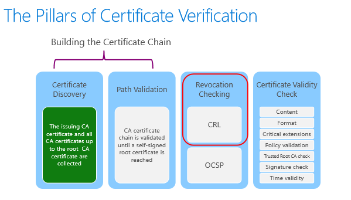

# Windows Server Managing and Supporting Active Directory Certificate Services(ADCS)


# Cryptography
It is secure communication in the presence of third parties.

## Goals of Cryptography

* Confidentiality - content is encrypted
* Data Integrity - content is not altered in transit
* Non-repudiation - sender of message cannot deny he did not send it at a later time
* Authentication - able to prove their ID to others

## Encryption Methods

* Symmetric Encryption - use same key to encrypt and decrypt, how to exchange key in a secure way would be a problem
  
    eg:  DES(Data Encryption Standard), 3DES, IDEA(International Data Encryption Algorithm), CAST, RC2,RC4,RC5,RC6, AES, Blowfish
* Asymmetric Encryption (aka Public Key Encrpytion)
  
    eg: RSA, DSA, ECC
* Hybrid Cryptography - the encryption and decryption algoritm used in `real world`

    - Asymmetric encryption is used to encrypt the shared key for symmetric encrpytion algorithm used to encryt the message
    - symmetric encrpytion is used to encrypt message
  
  ## Hash Functions & Digital Signatures
Hash is typically used to verify that a certain item has not been modified by providing a `digest` (or `fingerprint`)

How hashing works



### Characteristics of Digital Signatures
* Identification - the recipient can be sure of who send the message
* Integrity - recipient of a signed message can check it to make sure the message was not tampered
* Reliability/non-Repudiation - verify the sender truly sent the message with `digital signature`
  
# PKI

## Digital Certificate
Digital credentials comparable to digital ID or digital passport.

## Certificate Authorities (CA)
CA is a machine which issues corticates to different entities(users, computers, network devices etc)



Reasons for hierarchies
  
  * Security
  * Mapping trust 
  * Manageability - role separation
  * Flexibility - CA can be repleced easily for different levels of PKI

# Certificate Revocation and Chain Building
Digital Certificate normally expires after 1 year. In some situation might cause a certifcate to be revoked before its expiration due to:

* Certificate is no longer used
* Details of certificate are changed
* The certificate owner's private key was compromised
  
## Certificate Revocation List (CRL)

## Revocation Cache

### Disk Cache
Maintains copies of all CRL and OCSP responses retrieved; 

Items are maintained until their validity period expires;

### Memory Cahce
Contains revocation information used by a specific process;

Maintained within the memory used by the calling process;

## Online Certificate Status Protocol(OCSP)


# Deploy a Two-Tier PKI Hierarchy

## PKI Objects in AD
A PKI has no relationship to any AD, but when installing an AD integrated CA, AD will be used to store PKI related information that can be used by clients

related Information to AD Container

* AIA - Authority Information Access
* CDP - CRL Distrubution Points
* Certificate Templates
* Certification Authorities
* Enrollment Services
* KRA
* OID
* NTAuthCertificates
  
## Certificate Stores
Logical containers, holding one or more certificates;
logical view is comprised of the certificated from each of the physical certificate stores on the computer;

## PKI Pre-Installation Tasks

* CA Administrator


## Offline Root CA

* CA Auditing
* OS Auditing
* Publishing Root CA CRT and CRL Files
  
## Subordinate Issuing CA

* Install and Configure Subordinate Issuing CA

## Post-install Configuration

## Powershell-based Installation of Subordinate Issuing CA

* Powershell 4.0 Deployment Cmdlets
* Powershell 4.0 Administration Cmdlets

## Optional installation of CA Web Enrollment Proxy for FabrikamDevicesissuingCA01


# Security

## Exposure of CA Private Key

Private Key storage (Local Computer)

- On the CA's hard drive
- In the CA computer's memory

Private Key's Risk Exposure

CA private key - the most important logical piece of data in PKI world

CA private key might fall into the wrong hands:
  - physical hard disk can be stolen
  - backups can be compromised
  - virtualizd CA can be accessed by different people (Hyper-V admins, storage admins)

Stolen private key can be used to issue fraudulent certificates for unauthorized requestors

## Hardware Security Modules

Private Key storage (HSM)

CA private key can be stored on an Hardware Security Module(HSM), implementing an HSM is the **preferred** option.

Features of HSM

- Hardware protection of valuable private keys
- Acceleration of cryptographic operations
-  Enforce additional controls whenever the CA key is used (role separation, multiple eyes principle)
-  Load balancing and failover in hardware modules using multiple HSMs linked together through a daisy chain
-  Implementing an HSM is the answer to many (**not all**) security threats but adds cost and complexity to your environment

### Risk Exposure due to CA Backup

Risk exposure if HSM is not implemented;

Mitigation factors for backups including CA private keys

### Offline Certification Authorities
  - an offline certification authorities means:
  1. truly offline, do not have a network interface
  2. are not joined to an Active Directory domain
  3. CRLs, certificate and cert requests have to be copied manually
  4. If physical - keep it in a safe place (eg separate rack)
  5. If virtual - remove from hypervisor and store 2 copies on encrypted storage devices
  
  ### Offline CAs and network HSM

  If an offline CA is connected to a network based HSM:

- For virtual offline CA implementations, build a dedlicated VLAN between CA and the HSM
- For Physical offline CA implementations, establish a dedicated network connection to the HSM
- Use dedicate media to transfer data
- Update the OS with Service Packs and any updates that affect the logical operation of the CA
- Implement security Auditing
- use BitLocker or other full volume encrpytion method to encrypt hard disks

### CA Hardening

### Securing virtualized CAs

### Protecting the CA Serivce

## Role Separation

Common Criteria Roles

1. CA Administrator
2. Certificate Manager
3. Backup Operator
4. Auditor

## Auditing

CA Auditing

OS Auditing

# PKI Operations and Business Continuite

## CA High Availability 

- Semi redundant - 2 separate issuing CA with the same templates published
- Fully redundant - 1 issuing CA using Windows Failover Clustering

## Offline CA Maintenance

- Offline CA CRL Publishing

## Backup of PKI components

Backup Considerations

- Orphaned certificates
- Private key material presence
- Backup protection

### CA private key and database

## CA certificate Renewal

Validity period

1. increases the certificate validity period
2. Initial validity period is added to the date of the certificate renewal
3. validity period for a self-signed certificate can be modified prior to renewal using the `%windir%\CAPolicy.inf` file

```powershell
[certsrv_server]
RenewalValidityPeriodUnits = 20
RenewalValidityPeriod = years
```

### certificate renewal
1. same key pair
2. new key pair

### CA Renewal and CRL **Partitioning**


CA Renewal best practices

* Validity period of child CA should be no more than 50% of its parent
* Renewal of the CA certificate should be conducted at 50% of the validity period

## CRL Maintenance
1. Controlling CRL Size (size is increasing linear)
2. Plan for partitioning after 100k enrolled
3. plan for IDP (Issuing Distribution Point) 3rd party client support

Remove expried CRLs(if configured to be stored in the database)

## Emergency Procedures

CRL Re-Signing/Emergency CRL Signing

Manually extending the validity time of a CRL
* CA Migration
* CA Recovery
* Disaster Recovery

## Exit Modules

## CA Monitoring

# NDES - Advanced Enrollment Methods

NDES Overwiew: is a Microsoft implementation of Simple Certificate Enrollment Protocol (SCEP) used to enroll certificates to network devices

Allows switches/routers/smartphones.tablets to obtain certificates

Devices use NDES as proxy to get certificate from CA

## Prerequisites

# OCSP

## Chain Building


## Base and Delta CRLs

Delta CRLs contains the list of revoked certificates since the last base CRL issurance

## CRL Partitioning

## CRL Overlap Period

- Back-dated by 10 minutes by default (clock skew)

## **CRL under the hood - Revocation reasons**
1. unspecified
2. Key Compromise
3. CA Compromise
4. Change of Affiliation
5. Superseded
6. Cease of Operation
7. Certificate Hold 
8. Remove from CRL
9. Priviliege Withdrawn
10. AA Compromise


## OCSP Overview

In a nutshell:

1. OCSP client searches for locally cached time-valid OCSP response from prior query
2. OCSP client sends HTTP or HTTPS request to OSCP responder for certificate status providing the certificate serial # of interest
3. OCSP responder reploes with a signed response that includes the revocation status of teh certifcate based on its cached knowledge from the CRL issued by the CA
4. OCSP client validates the signature of the response prior to accepting and caching the response
5. Valid response cached for remaining duration of OCSP responder cached CRL

## OCSP Limitations

1. Scalability limitations

Online service responding to a single certificate status requests  results in higher load than CRL solution, requiring multiple and sometimes geographically dispersed servers to balance the load

2. The response signing and signature verification processes also takes time which can adversely affect the overall response time at the relying party

3. Finally, since the integrity of the signed resonse depends on the integrity of the OCSP responder's signing key, the validity of the key is verified after a response is validated by the client.
  

### OCSP Answers
* `Good`
* `Revoked`
* `Unknown`

## OCSP Deployment

# Windows Server ADCS Migration

